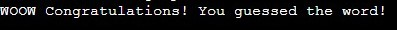

# Hangman Game

Hangman Game is a Python terminal game, which runs in the Code Institute moch terminal on Heroku.

The game selects a random word from a pre-defined list of words. The player has to guess the word one letter at a time. For each incorrect guess, a part of the "hangman" is drawn on the screen. The player has 6 incorrect guesses before the game is over.

 [View the live site here](https://game-hangman2.herokuapp.com/#)

## How to play

At the beginning of the game, a welcome message is displayed along with the rules of the game to the player. The game then selects a random word from a pre-defined list of words. The current status of the hangman, the number of guesses remaining, and the guessed letters are displayed (which is empty at this point). The player is prompted to guess a letter. If the guessed letter is correct, the game reveals the location(s) of the guessed letter in the word. If the guessed letter is incorrect, the game draws the next part of the hangman and reduces the number of guesses remaining. Steps 4-6 are repeated until the word is guessed or the player runs out of guesses. If the word is guessed before the player runs out of guesses, the game displays a "You won!" message and reveals the word. If the player runs out of guesses before the word is guessed, the game displays a "You lost!" message and reveals the word.

## Features 

### Existing Features

* Welcome message and game rules are displayed at the start of the game.
  * A random word is selected from a pre-defined list of words.
  * The player is prompted to guess a letter.
  * The player is prompted to guess a letter.

* If the guessed letter is correct.
  * The game reveals the location(s) of the guessed letter in the word.

* If the guessed letter is incorrect. 
  * The game draws the next part of the hangman and reduces the number of guesses remaining.
  * The game displays the hangman's current state based on the number of incorrect guesses made by the player.
  * The game continues until the word is guessed or the player runs out of guesses.

* If the word is guessed before the player runs out of guesses. 
  * The game displays a "WOOW Congratulations! You guessed the word!" message and reveals the word.

* If the player runs out of guesses before the word is guessed.
  * The game displays a "Sorry you lost!" message and reveals the word.

* The game asks if the player wants to try again.
  * If y the game start from the begining
  * if n the game stops and exit

### Future Features 

* Allow player to select categories
* Give more chances for the player

## Data Model 

The data model for the Hangman game consists of several attributes and methods. The Hangman class has a constructor that takes a list of words as a parameter and initializes several attributes, including the word to be guessed, the list of guessed letters, the number of allowed guesses, the number of incorrect guesses made by the player, the display word with underscores representing unguessed letters, and a list of art representations of the hangman as it is being drawn.

The class has methods to introduce the game to the user, choose a word at random from the list of possible words, and get a guess from the player. The guess method updates the display_word and guesses attributes based on the guess. The play method calls the intro, word_choose, and guess methods until the game is won or lost.

Overall, the data model represents a simple game with a clear objective: guessing a word before the hangman is fully drawn. The game's state is updated based on the player's input, and the game ends when the player has used all their guesses or correctly guessed the word. The class's attributes and methods encapsulate the game's state and behavior, making it easy to reuse and extend the code.

### Testing

I have manually tested this game by doing the following:

* I ran the game by running the script in my local terminal and the Code Institute Heroku terminal.
* The game displayed a welcome message, rules of the game, and a hint to guess a fruit.
* I was prompted to guess a letter.
* I guessed a letter that was in the word.
* The game displayed the updated word with the correct letters filled in and the number of guesses left.
* I repeated steps 3-5 until I guessed the entire word or ran out of guesses.
* If I guessed the entire word, the game displayed a congratulations message.
* If I ran out of guesses, the game displayed a sorry message with the correct word.
* I was prompted if I wanted to play again.
* If I chose to play again, the game started over from the beginning with a new word to guess.
* I repeated steps 3-10 until you were finished playing.

Overall, I manually tested the game by playing it multiple times and verifying that it functioned correctly according to the rules and gameplay.

### Bugs

### Solved Bugs

* Player was able to put numbers also for guessing the word. I fixed it by adding guess.isalpha() so incase the player input number will get error saying "Invalid input. Please enter a letter." 
* The game was not running and I discover it was because my indication for game.play() was not right. I fixed it and it started working

### Remaining Bugs

* No bugs remaining

### Validator Testing

* PEP8
  * Few errors was there but I managed it to fix it. Now no errors were returned from pep8ci.herokuapp.com

### Deployment

This project was deoplyed using Code Institut's mock terminal for Heroku

* Steps for deployment:
    * Fork or clone this repository
    * Create a new Heroku app
    * Set the buildbacks to Python and NodeJS in that order
    * Link the Heroku app to the repository
    * Click on Deploy

### Credits

* Code Institute for the deployment terminal
* Code Institute Love Sandwishes Project for inspiration and practice
* Code Institute Battleship Game Project for inspiration and practice

